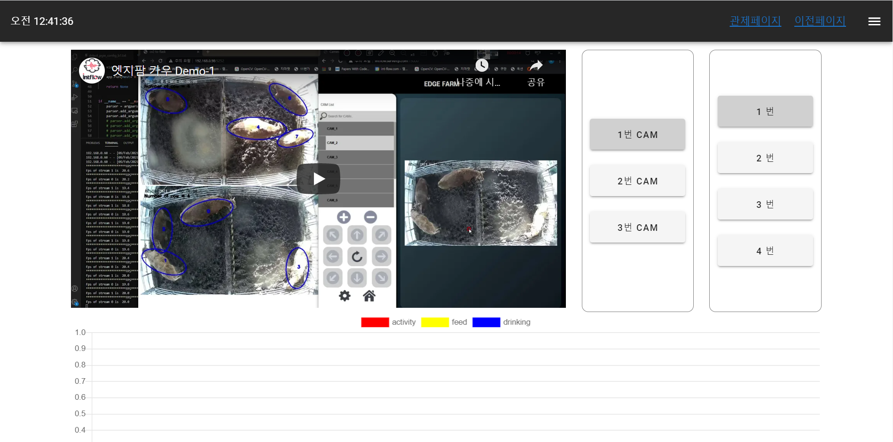
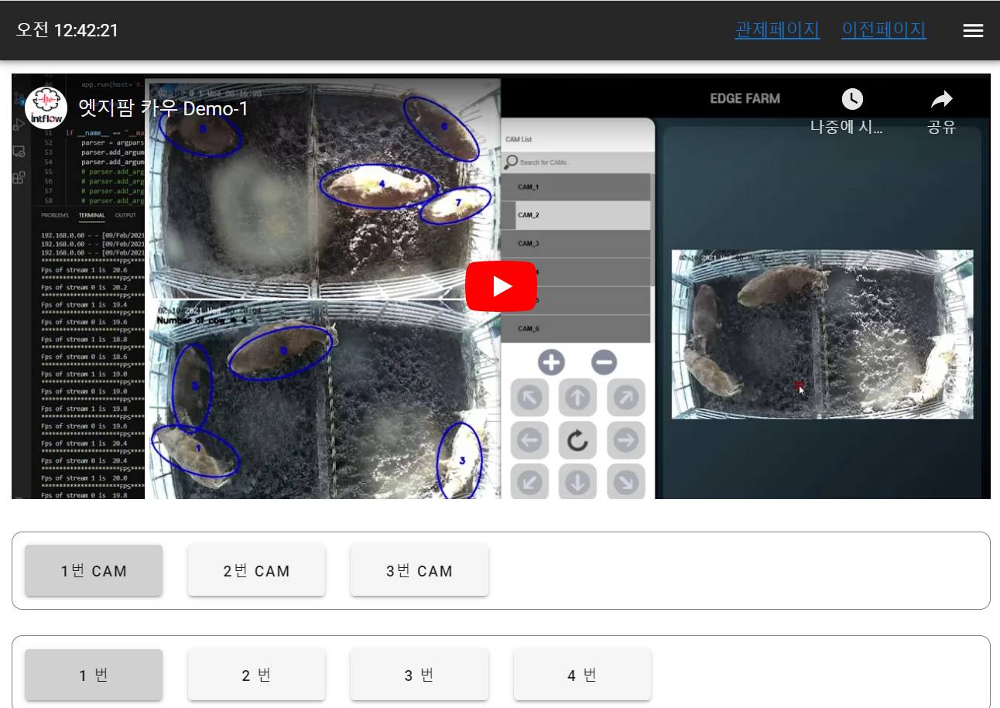

# Intflow 사전 과제

### back

- 사용 프레임워크 : Flask
- 참고자료 
  - https://flask.palletsprojects.com/en/1.1.x/
  - https://wikidocs.net/book/4542
- Flask에 대한 이해도 부족으로 data.py에 더미데이터를 넣어 만듬
- main_views.py에서 camera_info(객체 갯수), object_info(소의 상태) 정보를 다룸

### front

- 사용 프레임워크 : Vue.js

- 참고자료

  - https://vuetifyjs.com/
  - https://vue-chartjs.org/

- 구성

  - src/router로 페이지별 url 관리
  - src/components에 SPA에 활용되는 리소스 관리
  - axios로 flask 서버와 통신

- 반응형 페이지

  vuetify의 md 사이즈(960px) 기준으로 세로모드와 가로모드 전환

  - 가로모드
  
  
  - 세로모드
  